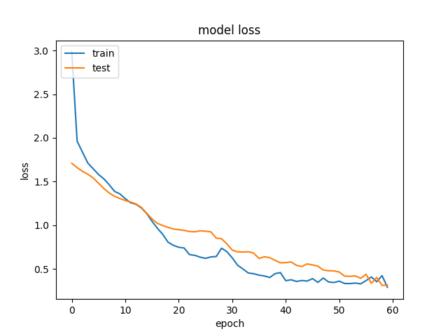
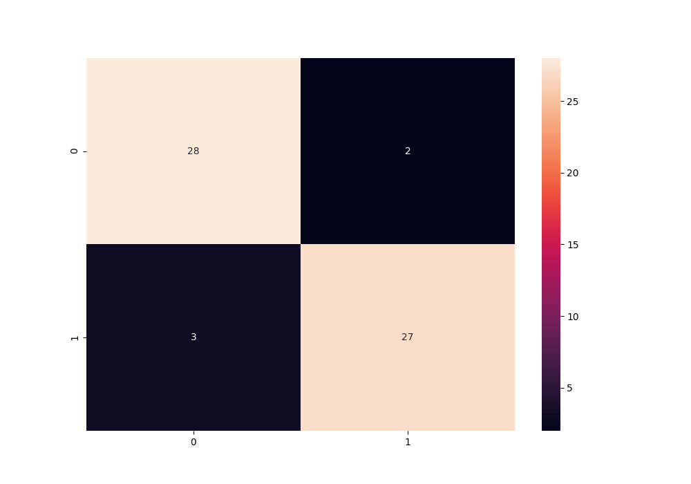
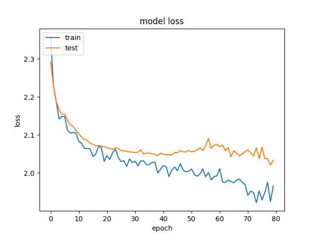
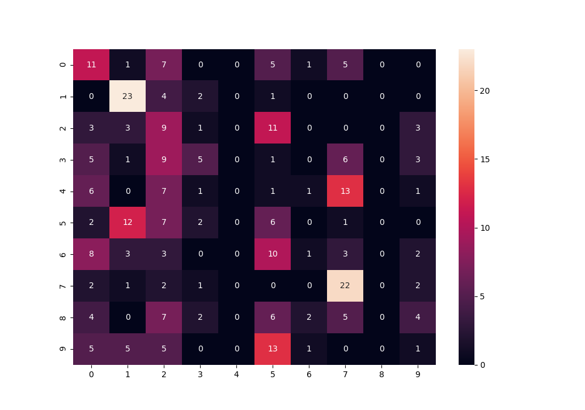

## Architecture
#### Blocks
The model is a standard setup with 3 convolutional blocks. It was really easy to get a very low training error, indicating over-fitting, so more blocks did not seem necessary.  
#### Loss Function
Since the data is categorical and has a large number of categories, any loss function that uses the distance between the ones and zeros, like `root mean square error` would make no sense. We need a loss function that just looks at the number of hits and misses. `categorical cross-entropy` is such a function.
Another, maybe even more fair option would be to calculate the `area under the ROC` directly after every step, but I haven't seen an out-of-the-box version of that.
#### Dropout
Dropout is always a safe way to add randomness, making the model more robust and less flexible. 
The good thing about it is that it doesn't fake any input data and can therefor not make any wrong assumption about it.
The downside is that dropout cannot really help you with small data.

#### Tuning
I have manually tuned the drop-out a bit, to make the model less flexible and to find a balance between train-error and test-error. 
The logical next step would be to perform a hyper-parameter search including drop-out and number of nodes per layer, which I haven't gotten to. 
This would also mean splitting the data up into three parts, making the training set even smaller.  

#### Filterbanks
Convolutional neural networks  are designed for image recognition and are 
currently the industry's best practice for processing audio. 
However, they have a build-in blind spot for harmonics. 
If spectrograms are directly fed into a conv-net, 
in theory this should never be able to perform as good as with images. 
Filterbanks can be used to spot those harmonics before feeding the data into the model. (I haven't gotten them to work for this exercise).

## Data Augmentation
With such a small dataset, data synthesis is probably a good strategy. However, because audio data has some specific characteristics it's easy to make mistakes when doing this.
#### White Noise
While adding white-noise is a good strategy to make a model more robust, I'm not convinced if it's very useful for this specific task. 
The purpose of adding white-noise would be to make your model better at 
finding sound patterns in a noisy signal, like audio recorded in a noisy environment. 
But these are all studio recordings where a lot of effort went into reducing back-ground noise. 
So it might help, but I don't expect any miracles.
 

There are also some mistakes one can make with with-noise: 
- White noise can be an indicator for live recordings. By adding it you are removing that information from your data.
- When adding white noise, you probably want to add it before creating the logarithmic spectrograms, otherwise your white-noise ends up being very dense in the lower frequencies and very sparse in the higher frequencies. Which is a type of noise that, as far as I know, doesn't occur in real life.
- When adding any kind of noise, make sure that distribution of that noise is at least as big as the data size, otherwise the model will start finding patterns in the noise.
#### Compression, Reverb, Distortion
I would stay away from any audio effects that are used when recording music, 
since they can be indicative for genre or era. 
For example: reverb became very popular in the 80ies but is never added to classical music, 
distortion is heavily used in punk, but hardly in jazz, classical music is never compressed 
(which is why it is so annoying to hear on an old car-radio), whilst pop music seems to get more compressed every year...
#### Pitch
Changing pitch can be a very good way of making a model accept songs in all keys. I would guess that there is no pattern between key and genre. 
However, although there is very good software out there to change the pitch of an isolated source like vocals, 
I am not sure how easy it is to change the pitch of a combined signal like music without distorting it. 
Note: For western music, when you change the pitch you want to stick to the 12-key scale. 
#### Time
Stretching or compressing time a little bit might be a good way of synthesising data, but I would keep the changes small since tempo can be indicative for genre. 
#### Segmenting
My first choice of data augmentation strategy would be to segmenting the the 30 second audio clips into way smaller ones, say 1 or 2 seconds. 
Our ear can recognise a genre in a couple of seconds, so a model should be able to do the same.
Segmenting has several benefits:
* You skip the wrong instructing that the model should look at the 30s clips as a whole.
* By chopping up the clips the number of samples increases.
* If one uses a sliding window, you also add a time-shift aspect to the model.

## Results
#### Two classes
On just two classes the results are actually quite good. 

#### Multi class
The multi class results are terrible. But on the bright side, the low training error indicates that there is room for improvement with just tweaking the flexibility of the model. A hyper-parameter search would be a good next step.

